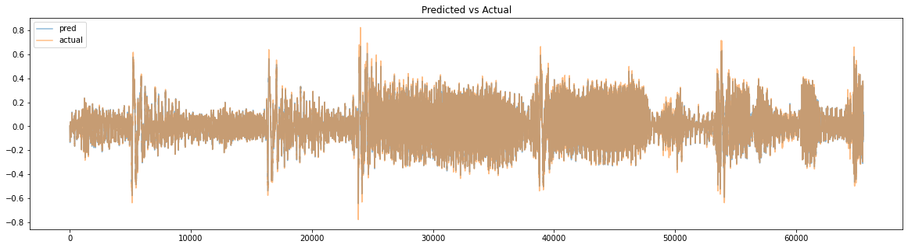
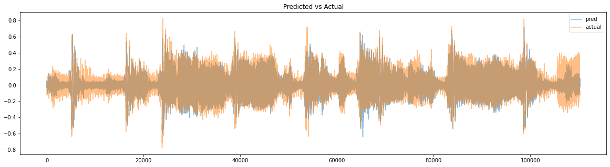
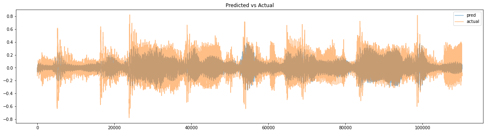

## Aim
We are given the frequency representation of an acoustic signal and we want to reconstruct the original signal.
In this notebook, we will be considering three frequency distributions, namely STFT, Reassigned Spectrogram and Kymatio's
1D Scattering transform. 

## Approach
Some of the transforms don't have an explicit inverse. So, we will be using neural networks to learn an inverse transform.

A brief overview of my approach for inverting different representations is given below. The visual and aural results along with some further observations can be found in the notebook.
**The notebook is also available on [colab](https://colab.research.google.com/drive/1DnsYvTxox5d21V6bAUjZ3FGw5H-dDz47?usp=sharing).**

### STFT
We compute STFT with hop_length of 512. So, if the signal length is N, we get n\_frames=(N//512+1)
for an audio clip (assuming padding is enabled i.e. center=True in librosa). 
Since we are using n_fft=2048, the dimension of STFT is (1+n\_fft/2) x n\_frames. Specifically, the time representation for
ith STFT is the indices from hop_length\*i to(hop_length\*(i+1).

Since STFT output is complex number, we split it to form 2 channels containing real and imaginary part. The final neural network **input** is of the form of B x (1+n\_fft/2) x 2 and the **output** is of the form B x hop\_length where B is the batch size.
In the inverse STFT algorithm. the frequency representation is first passed through a windowing function. This motivated me to add a learnable windowing function in the neural network. So, the input (i.e. STFT) is first fed into the learnable windowing function and then passed to a single fully connected layer with tanh non-linearity. This simple network was able to get good results even on the unseen test set. The network was trained for 100 epochs with Adam optimizer. ReduceLROnPlateau was used as learning rate scheduler.

### Reassigned STFT
We use librosa's [reassigned_spectrogram](https://librosa.org/doc/latest/generated/librosa.reassigned_spectrogram.html) to obtain the frequency representation. In my initial experiments, I found that a straightforward approach like using RA freq. representation as input to network and trying to predict time representation directly doesn't yield good results. The network output doesn't sound good even for the training set.

I modified the network to output STFT representation & the time representation. The STFT is an auxillary output that is used **only** during the training of network. My reasoning was that if we can somehow get the network to predict STFT correctly, then our life becomes simpler since we have already developed a learnable mapping for STFT.

I found that using this approach, the network was able to give good predictions for the training set. The output of librosa's reassigned_spectrogram is concatentated into a feature vector which is then normalized and preprocessed and fed into the neural network. The input to network is of the form B x feat\_dim and network has two outputs, STFT output of the form B x (1+n\_fft/2) x 2 and time representation of the form B x hop\_length.

Loss = MSE(pred_stft, actual_stft) + alpha \* MSE(pred_waveform, actual_waveform). 
I set alpha=100

The input is fed into four fully connected layers with LeakyRelu non-linearity to predict STFT. A Residual connection after first two layers was found to improve the result slightly. Similar to our STFT experiment, the predicted STFT is passed through a learnt window and then into a single fully connected layer with tanh non-linearity to obtain the acoustic signal. Please refer to **RAModel** in train_utils.py for exact architecture details.
The network was trained using AdamW optimizer for 50 epochs and ReduceLROnPlateau was used as learning rate scheduler.

### Kymatio's 1D scattering transform
Kymatio's [Scattering1D](https://www.kymat.io/codereference.html) function was used for the scattering transform. I used the  RA STFT network and training strategy for reconstruction of the acoustic signal. Again, the network was abe to output reasonable result on train set. However, the performance deteriorates for test set.
I also experimented with the reconstruction approach found in [Kymatio's example](https://www.kymat.io/gallery_1d/reconstruct_torch.html). In my initial experiments, I was unable to obtain good results using this approach.

## Recoonstructed Waveforms
Below are the reconstructed waveforms for Brahm's audiofile. **Please refer to the [notebook](./invert-freq-1.ipynb) for detailed visual and aural reconstructions for each frequency representation.**

### Reconstruction from STFT 

### Reconstruction from Reassigned Spectrogram 

### Reconstruction from Kymatio's 1D Scattering transform 

